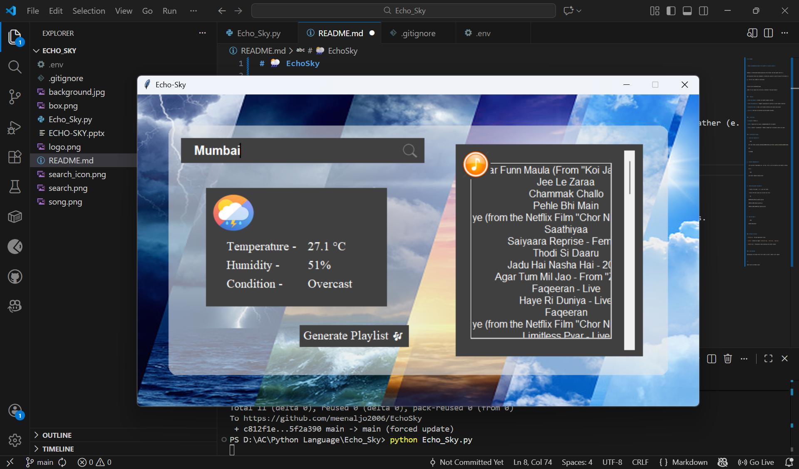

# 🌦️ EchoSky

> **Music Recommendation based on the weather of a specific place.**

EchoSky is a Python-based desktop application that fetches real-time weather data for a user-specified location and recommends a curated music playlist to match the mood of the weather (e.g., Lo-Fi for rain, Upbeat for sunny days).



### 🚀 Features
* **Real-time Weather:** Fetches live weather updates using API.
* **Smart Recommendations:** Suggests songs/playlists tailored to current weather conditions.
* **Interactive GUI:** A clean, user-friendly interface with custom visual assets.
* **Secure:** API keys are protected using Environment Variables.

### 🛠️ Tech Stack
* **Language:** Python 
* **APIs:** Spotify API (for music), OpenWeatherMap API (for weather)
* **GUI:** Tkinter

### ⚙️ Installation & Setup
1.  **Clone the repository:**
    ```bash
    git clone [https://github.com/meenaljo2006/EchoSky.git](https://github.com/meenaljo2006/EchoSky.git)
    cd EchoSky
    ```

2.  **Install dependencies:**
    ```bash
    pip install -r requirements.txt
    ```

3.  **Setup Environment Variables:**
    * Create a file named `.env` in the root folder.
    * Add your API keys inside (do not share this file):
    ```env
    WEATHER_API_KEY=your_weather_api_key
    SPOTIFY_CLIENT_ID=your_spotify_id
    SPOTIFY_CLIENT_SECRET=your_spotify_secret
    ```

4.  **Run the App:**
    ```bash
    python Echo_Sky.py
    ```

### 📂 Project Structure
* `Echo_Sky.py`: The main application script.
* `ECHO-SKY.pptx`: Presentation slides explaining the project concept.
